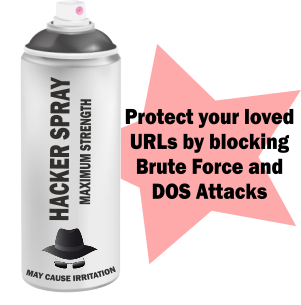

# Hacker Spray

 

**A .NET library to defend websites and web APIs against brute force and Denial-of-service attacks.**

Features:

 * Protect login, registration, password reset pages against brute force and DOS attacks. 
 * Block users from **performing any action too many times**. 
 * Prevent too many hits from any IP or IP Range. 
 * Blacklist/Whitelist specific IP, IP range, username, URLs, transactions for a period.

An example scenario is a Bank Login page, where brute force password attempts on user accounts and DOS attack on Login page are a regular event. 
Using this library, you can protect login page from brute force attacks, blocking too many usernames from certain IPs, 
or too many hits from a range of IP trying to do DOS attack, 
or even simple 3 invalid login attempts per username, per 15 mins. 

This high performance, very lightweight library protects you from hitting the database too many times on pages and APIs that are prone to attacks, thus lowering web server and database CPU, increasing the scalability of the overall application.

# How it works

Hacker Spray uses Redis to maintain high-performance counters for actions and origin IPs. 
Clients call ``Hacker.Defend(key, ip)`` to check if a certain key or IP has made too many hits. 
Clients can maintain blacklists for key, IP or IP Range. 
HackerSpray checks against too many hits on a key, too many hits on an IP, or IP falling within blacklists. 
It also allows blacklisting a certain key for a certain IP or blocking a certain key for all IPs on-the-fly. 
Handy when you want to block a user out of certain URLs. 

It comes with a HttpModule, which protects your entire website. 

Example calls:

```c#
var result = await Hacker.DefendAsync("/Account/LogOn", Request.UserHostAddress);
if (result == Hacker.Result.TooManyHitsFromOrigin)
    await Hacker.BlacklistOriginAsync(Request.UserHostAddress, TimeSpan.FromMinutes(10));
else if (result == Hacker.Result.TooManyHitsOnKey)
    await Hacker.BlacklistKeyAsync("/Account/LogOn", TimeSpan.FromMinutes(10));

.
.
.
Hacker.DefendAsync("/Account/PasswordReset", Request.UserHostAddress, TimeSpan.FromMinutes(5), 100);
Hacker.DefendAsync("Username" + username, Request.UserHostAddress);
Hacker.DefendAsync("Comment", Request.UserHostAddress);
```

Hacker Spray is a fully non-blocking IO, .NET 4.5 async library, maximizing use of Redis pipeline to produce least amount of network traffic and latency. It uses the ``StackExchange.Redis`` client.

There's a convenient ``DefendAsync`` overload for ASP.NET Controllers. You use it like this:

```c#
[HttpPost]
public async Task<ActionResult> LogOn(string username, string password)
{   
    return await Hacker.DefendAsync<ActionResult>(async (success, fail) =>
    {
        var user = await AuthenticateUsingDatabase(username, password);
        if (user!= null)
        {
            Session[SessionConstants.USER] = user;
            return await success(RedirectToAction("Index", "Home"));
        }
        else
        {
            TempData[TempDataConstants.ERROR_MESSAGE] = "Invalid username or password";
            return await fail(View("~/Views/Account/LogOn.cshtml"));
        }
    },
    blocked => new HttpStatusCodeResult(HttpStatusCode.Forbidden),
    "ValidLogin:" + username, MaxValidLogin, MaxValidLoginInterval,
    "InvalidLogin:" + username, MaxInvalidLogin, MaxInvalidLoginInterval,
    originIP);           
}
```

This ``DefendAsync`` allows you to wrap your existing Controller code with the defence. 
You put the existing code in your Controller methods inside the ``async (success, fail)`` delegate.
Then while returning the response object, you wrap the return object with ``success()`` or ``fail()``. 
HackerSpray will then maintain success and failure counters. 
If there are too many success or failed attempt as per the configuration, it will block further execution 
of the code inside the delegate, thus protecting your expensive business logic from attacks. 

# Getting Started
## Nuget
Get the Hacker Spray library and HTTP Module to defend your website using:

    Install-Package Hacker.WebModule

Or you can just drop the Hacker.XXX.dll files in the bin folder and proceed with the configuration.

## Source code
Download the source code. The Hacker.Module contains the library to implement your own defense. 

``Hacker.WebModule`` project contains ``HackerSprayHttpModule``, which you can use to implement configuration driven centralized defense for the entire website.

## Using Hacker Spray
### Step 1
In the ``web.config`` you need to specify which paths to protect using the ``HttpModule``, if you are planning to use the HttpModule. 

```xml
<HackerSprayConfig redis="localhost" prefix="AuthTest:">
    <keys>
      <add name="/Account/LogOn/" post="true" maxAttempts="100" interval="00:10:00" mode="perkeyperorigin" />
      <add name="/Home/" post="false" maxAttempts="10000" interval="00:01:00" mode="perorigin" />
      <add name="/" post="false" maxAttempts="10000" interval="00:01:00" mode="perorigin" />
    </keys>
  </HackerSprayConfig>
```
 - **redis** - This is the connection string to Redis server.
 - **prefix** - All keys created in redis is prefixed with this.
 - **keys** - one entry per path that you want to protect
    - **name** - The Path to match
    - **post** - true = POST, false = GET
    - **maxAttempts** - max number of hits to allow
    - **interval** - hits for how long?
    - **mode** - How to count the hits and apply blocking
      - _perkey_ - count hits from all IPs to this key. For ex, allow maximum 1000000 hits to Home page in 10 minutes period.
      - _perorigin_ - While checking hits to this key, if the origin IP has produced more than the maxAttempts hit overall on any key, then block. For ex, allow 1000 hits per IP, to any key, but do this check on Login page hit.
      - _perkeyorigin_ - Count hits to this key, per IP. For example, 1000 hits per IP on the Login page. 

### Step 2
Add the Hacker Spray ``HttpModule`` in web.config:

```c#
<system.webServer>    
    <modules runAllManagedModulesForAllRequests="true">
      <remove name="HackerSprayHttpModule" />
      <add name="HackerSprayHttpModule" type="Hacker.WebModule.HackerSprayHttpModule" />
    </modules>    
  </system.webServer>
```

### Step 3

Run a [Redis](http://redis.io/) node or a [cluster](http://redis.io/topics/cluster-tutorial) of Redis nodes. Provide the redis connection string in IP:host form in the web.config. If you are running multiple nodes in the cluster, provide IP:host for all nodes. 

That's all!

# Operational Monitoring & Dashboards

## Logging

## Visualizing blocking activity

## Measuring performance impact 

## Measuring Redis performance